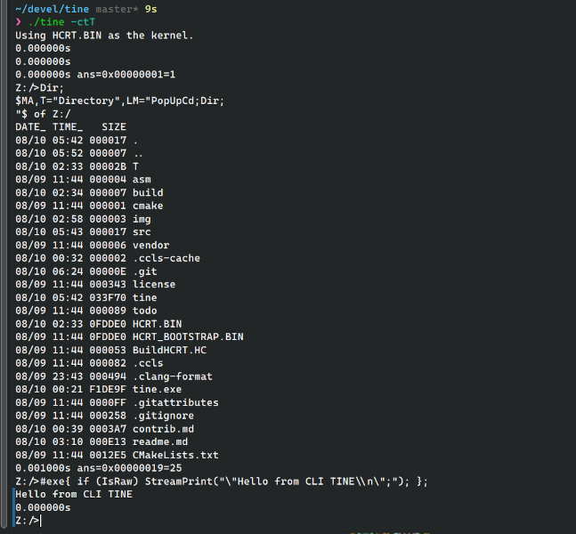

#  TINE Is Not a (TempleOS) Emulator
 \* *logo courtesy of CrunkLord420*

## table of contents
 - [features](#features)
 - [required skills](#required-skills)
 - [system requirements](#system-requirements)
 - [***building & running***](#building)
 - [showcase](#showcase)
 - [changes from vanilla TempleOS](#changes-from-vanilla-templeos)
 - [contributing](#contributing)
 - [documentation](#documentation)
 - [short reference](#ref)

## features
- seamless filesystem integration, no mounting virtual disks or anything(primary annoyance when working with vanilla TempleOS)
- networking through FFI using the [dyad](https://github.com/rxi/dyad) library(powers builtin wiki)

    you may want to read dyad's source code(it's not big) and networking examples in `T/{Community,Server}`

- [wiki that guides you through HolyC and TempleOS](#documentation)
- run HolyC as a scripting language! `./tine -ctT <filename>.HC`
- [CLI mode for quick a HolyC REPL in the terminal](#cli)

# showcase


an example of HolyC/TempleOS' `#exe{}` and freedom of directly fiddling with system-level facilities mimicing `#undef` of ISO C

## cli


## required skills
 - knowledge of TempleOS
 - knowledge of C(HolyC specifically but you'll catch on easily)
 - (optional but recommended)knowledge of GDB/LLDB for debugging the loader(in case something goes wrong)

## system requirements
 - AMD64 architecture
 - Operating System: Linux, FreeBSD or Windows


# building
## windows users
### only supports >=Win10(complain to msys2 devs not me), msvc unsupported
install msys2, launch the "MSYS2 MINGW64 Shell", and run the following
```
pacman -Syu mingw-w64-x86_64-{cmake,gcc,ninja,SDL2}
```
if pacman tells you to restart the terminal then do it and run the cmd again
## unix-like system users
install SDL2, cmake, ninja and gcc
## building the loader and runtime
```shell
mkdir build;
cd build;
cmake .. -GNinja;
ninja;
```
side note: statically linking SDL2 on windows seems like std{in,out} gets borked so i did not make the resulting binary static, so make sure to run the built binary in the mingw terminal to avoid dll hell <br>
FOR MAINTAINERS AND CONTRIBUTORS: USE THE `-DBUILD_HCRT=OFF` FLAG TO DISABLE AUTO-BUILD OF HCRT.BIN IF YOU'RE WORKING WITH THE LOADER
## running
```
./tine -t T #-h for info on other flags
```

# changes from vanilla TempleOS
`Fs` and `Gs` are not `_intern` anymore, instead they are replaced by normal functions so `&Fs->member` must be replaced by `&(Fs->member)` <br>
The Windows key functionality has been replaced with the Alt key <br>
due to running in userspace, context switching is around 4 times slower(not that it matters anyway outside of flexing `CPURep(TRUE);` results) and ring 0 routines like In/OutU8 are not present <br>
division by zero is not an exception, it will bring up the debugger(SIGFPE)

# contributing
[read this](./contrib.md)

# documentation
```C
Cd("T:/Server");
#include "run";
//point browser to localhost:8080
```
contributions to wiki appreciated <br>
files uploaded to wiki must only have names ***shorter*** than 38 characters


# ref
```C
DirMk("folder");
Dir;
Dir("fold*");//supports wildcards
Cd("folder");
Man("Ed");
Ed("file.HC.Z");
Unzip("file.HC.Z");//unzip TempleOS compression
Zip("file.HC");
Find("str",,"-i");//grep -rn . -e str
FF("file.*");//find .|grep file
MountFile("Something.ISO.C");//MountFile(U8 *f,U8 drv_let='M');
Cd("M:/");//defaults to M
INT3;//force raise debugger
DbgHelp;//help on how to debug
ExitTINE(I32i ec=0);
```
